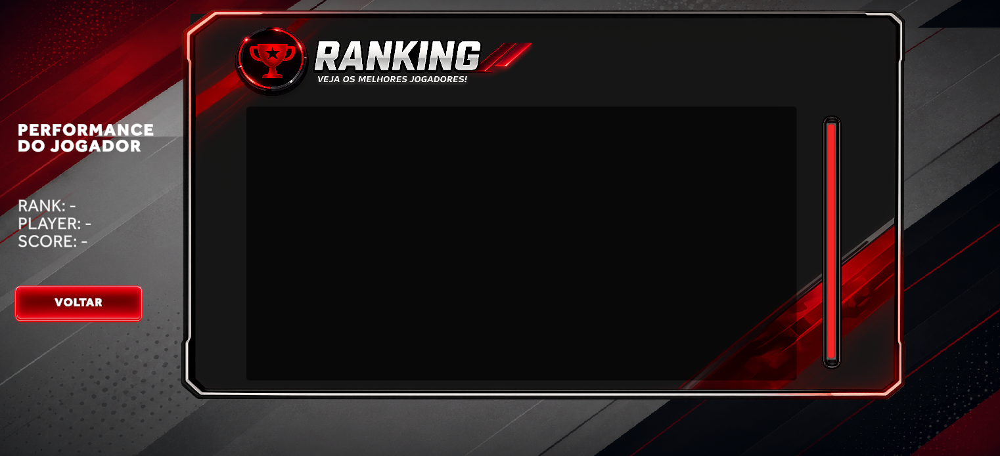

<p align="center">
  
</p>

<h1 align="center">TNT Basketball</h1>

<p align="center">
Fast-paced arcade basketball experience developed with Unity and C#.
</p>

<p align="center">
  <strong>From concept to code.</strong>
</p>

<p align="center">
  
  
  
  
</p>

---

# About The Project

TNT Basketball is a fast-paced arcade basketball game developed as the final project for the **AI Game Developer Bootcamp**, organized by **SoulCode Academy** in partnership with **TNT Energy Drink** and **Grupo Petrópolis**.

The project was designed to deliver a competitive and visually polished gameplay experience focused on:

- timing precision
- combos
- score multipliers
- power-ups
- responsive feedback
- competitive ranking systems

Inspired by the energetic identity of TNT Energy Drink, the game combines arcade gameplay with modern esports-inspired visuals.

---

# My Role

Main contributions during development:

- Gameplay systems
- Score & combo logic
- Power-up systems
- UI implementation
- Responsive HUD adjustments
- Gameplay balancing
- Audio & visual feedback integration
- General gameplay flow polishing

---

# Technical Highlights

## Modular Architecture

The gameplay was built using modular systems for:

- score handling
- combo systems
- multipliers
- TNT energy mechanics
- power-ups
- ranking system
- visual feedback
- audio systems

This structure improved:

- scalability
- maintainability
- readability
- overall performance

---

## WebGL Optimization

The game was optimized for browser execution with focus on:

- performance
- fast loading
- mobile compatibility
- responsive interface behavior

---

## Responsive Interface

The UI was adapted for:

- Desktop
- Notebook
- Mobile Landscape

---

## Visual Polish

A large part of the project focused on gameplay feel and visual clarity:

- responsive HUD
- arcade-style visual effects
- hit feedback systems
- UI readability
- esports-inspired visual identity

---

# Technologies

```txt
Unity 6
C#
WebGL
TextMeshPro
Git & GitHub
Photoshop
Canva
Generative AI for visual ideation
````

---

# Screenshots

## Gameplay

<p align="center">
  
</p>

---

## Tutorial

<p align="center">
  
</p>

---

## Ranking

<p align="center">
  
</p>

---

## Credits

<p align="center">
  
</p>

---

## Main Menu

<p align="center">
  
</p>

---

## Skin Selection

<p align="center">
  
</p>

---

## Name Input

<p align="center">
  
</p>

---

# Play The Game

<p align="center">
  <a href="https://grupo-1.itch.io/tnt-basketball" target="_blank">
    
  </a>
</p>

<p align="center">
  https://grupo-1.itch.io/tnt-basketball
</p>

---

# Compatibility

Currently supported on:

* Desktop
* Notebook
* Mobile Landscape

Portrait mode is not officially supported yet.

---

# Team

* Anthony da Silveira Bugs (Tech Lead)
* Gabriel José Araújo
* Adolfo Athayde
* Wallyson Schumacher
* Laila Zappiello

---

# Disclaimer

This project was developed for educational and portfolio purposes in partnership with:

* TNT Energy Drink
* SoulCode Academy
* Grupo Petrópolis

All trademarks and visual assets belong to their respective owners.

---

<p align="center">
  <strong>TNT Basketball</strong><br/>
  Built with Unity & C#
</p>

