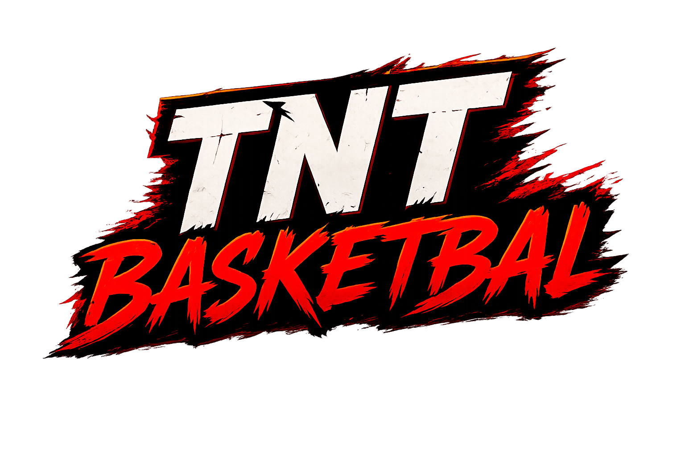
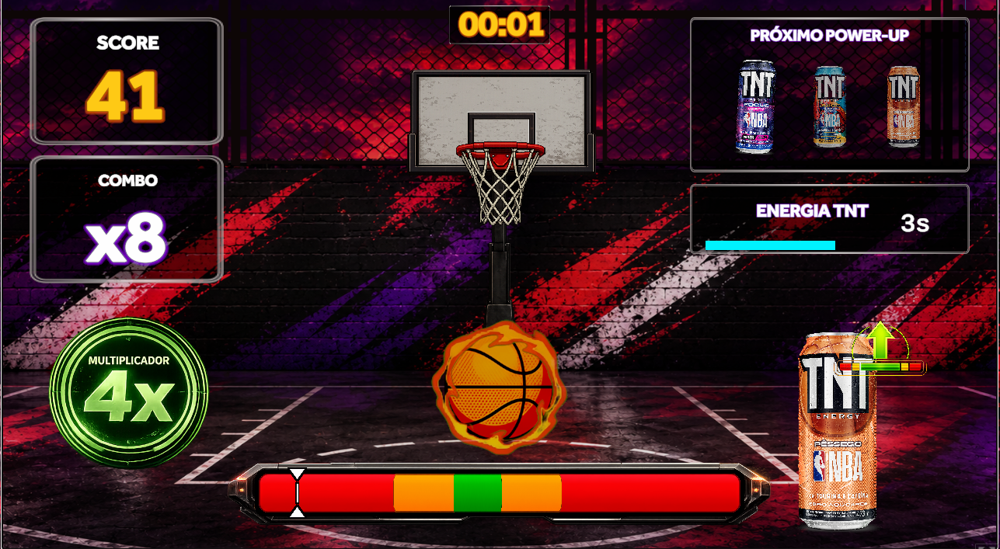
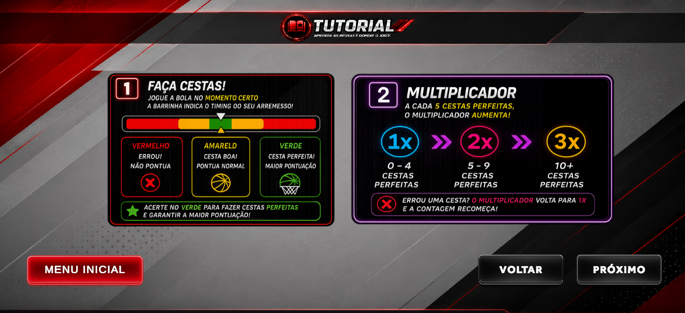
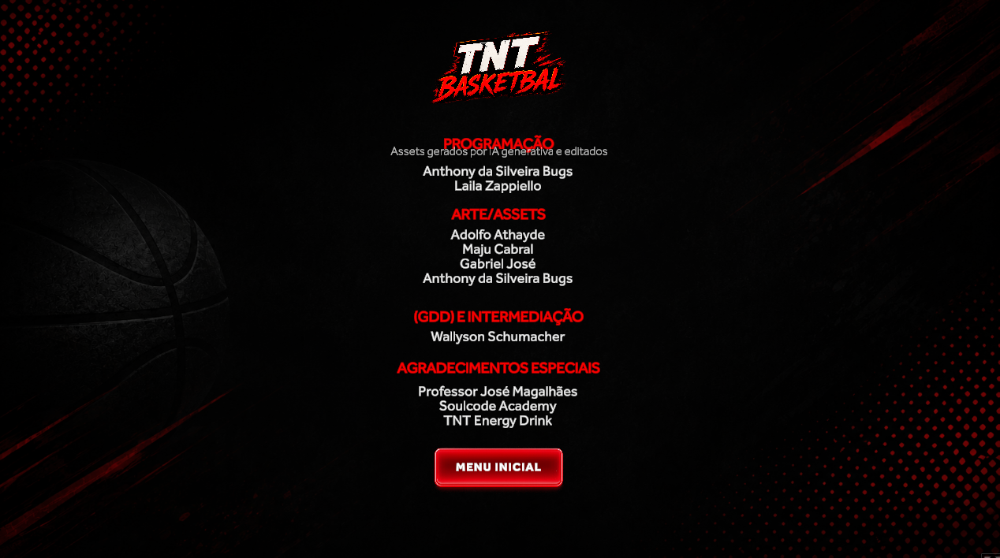
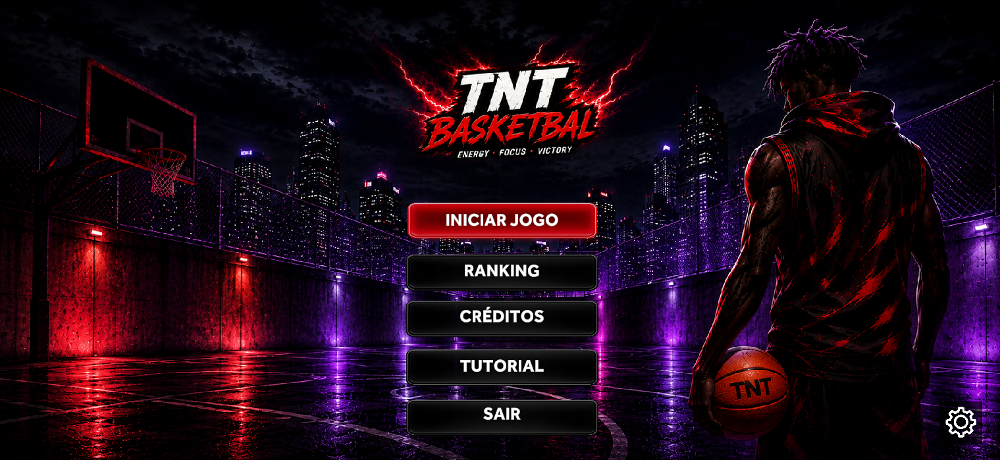
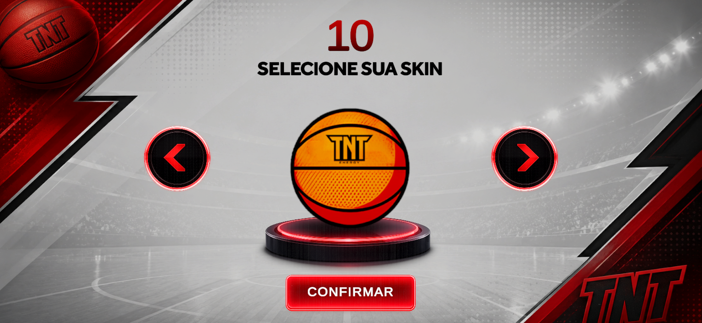
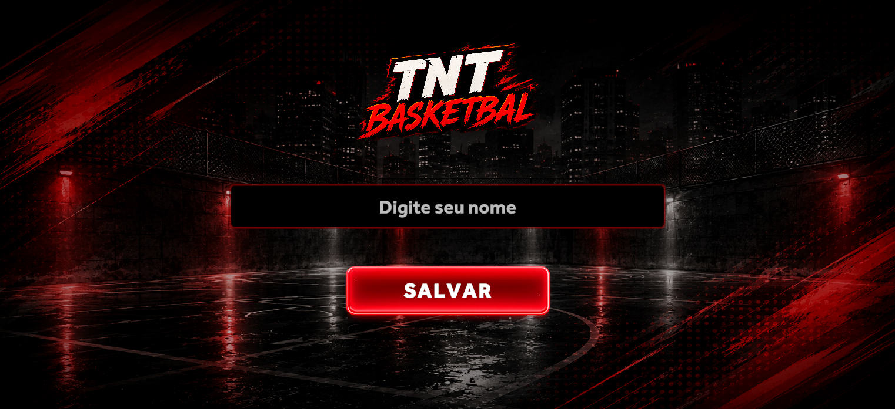

  

<h3 align="center">
Fast-paced arcade basketball inspired by the energy of TNT Energy Drink
</h3>

  
  
  
  

---

# TNT Basketball

TNT Basketball é um jogo arcade de basquete desenvolvido em Unity como projeto final do bootcamp Desenvolvedor de Games com IA, realizado pela **SoulCode Academy em parceria com a TNT Energy Drink e Grupo Petrópolis.

O projeto foi criado para entregar partidas rápidas, competitivas e visualmente marcantes, combinando:

- precisão
- timing
- combos
- multiplicadores
- power-ups
- ranking competitivo

Tudo isso inspirado na identidade energética e intensa da TNT Energy Drink.

---

# Objetivo do Projeto

A proposta do jogo foi criar uma experiência:

- simples de aprender
- competitiva
- dinâmica
- acessível
- visualmente impactante

Além da gameplay arcade, o projeto também conecta o universo da TNT ao estilo visual moderno de esports e jogos competitivos.

---

# Destaques do Desenvolvimento

## Interface Responsiva

Toda a interface foi refeita e adaptada para:

- Desktop
- Notebook
- Celulares na horizontal (Landscape)

---

## Estrutura Modular

A gameplay foi construída utilizando sistemas independentes para:

- pontuação
- combos
- multiplicadores
- energia TNT
- power-ups
- ranking
- feedback visual
- áudio

Essa estrutura tornou o projeto:

- mais organizado
- escalável
- performático
- fácil de manter e expandir

---

## Otimização WebGL

O jogo foi otimizado para rodar diretamente no navegador, priorizando:

- estabilidade
- carregamento rápido
- compatibilidade mobile
- responsividade

---

## Polish Visual

Grande parte do desenvolvimento foi dedicada ao refinamento visual da experiência:

- HUD responsiva
- feedbacks visuais de acerto
- efeitos arcade
- clareza visual
- contraste
- identidade cyberpunk/esports

---

# Tecnologias Utilizadas

txt  
Unity 6  
C#  
WebGL  
TextMeshPro  
Git & GitHub  
Photoshop  
Canva  
IA Generativa para criação visual  

---

# Screenshots

## Gameplay

  

---

## Tutorial

  

---

## Ranking

  

---

## Menu Principal

  

---

## Seleção de Skin

  

---

## Entrada de Nome

  

---

# Equipe

  Anthony da Silveira Bugs 
  Gabriel José Araújo 
  Adolfo Athayde 
  Wallyson Schumacher 
  Laila Zappiello

---

# Experimente o sabor de ser o máximo

  

  <a href="https://grupo-1.itch.io/tnt-basketball">
    grupo-1.itch.io/tnt-basketball
  </a>

---

# Repositório

  <a href="https://github.com/Hossomii/TNT-game">
    github.com/Hossomii/TNT-game
  </a>

---

# Compatibilidade

Atualmente o jogo possui suporte oficial para:

- Desktop
- Notebook
- Celulares na horizontal (Landscape)

O modo vertical/retrato ainda não possui suporte oficial.

---

# Direitos Autorais

Este projeto foi desenvolvido exclusivamente para fins educacionais e demonstrativos em parceria com:

- TNT Energy Drink
- SoulCode Academy
- Grupo Petrópolis

Todo o conteúdo visual, gameplay, interface, identidade visual, assets e código presentes neste repositório fazem parte do desenvolvimento original da equipe responsável pelo projeto e dos materiais disponibilizados pela TNT Energy Drink.

## Não é permitido

- reutilizar assets
- copiar interfaces
- redistribuir arquivos
- republicar o projeto
- utilizar partes do código ou identidade visual sem autorização

---

© TNT Basketball — Todos os direitos reservados aos desenvolvedores do projeto.

